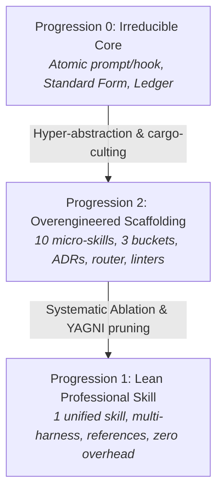

# Architectural Ablation Study: Grill-Logic

This document formalizes the architectural progression and ablation analysis for **Grill-Logic**. It documents why a lean, unified epistemic skill was chosen over a fragmented multi-skill framework, isolating components that provide genuine truth-maintenance value from those that introduce operational friction.

---

## 1. Architectural Progressions Overview

We evaluate three distinct stages of the system's design:



| Dimension | Progression 0: Irreducible Core (Original Idea) | Progression 1: Lean Professional Architecture (Selected) | Progression 2: Overengineered Scaffolding (Rejected) |
| :--- | :--- | :--- | :--- |
| **Number of Skills** | **1 unified prompt/hook** | **1 primary skill (`grill-logic`)** | **10 separate skills** across 3 categories |
| **Execution Flow** | Continuous CoT / prompt interaction | Single prompt workflow with clear internal phases | Chained tool-call serialization across 5+ sub-skills |
| **Context Overhead** | Minimal; everything in immediate context | Zero IPC/tool-call loss; structured ledger | Severe context bloat; model juggles inter-skill hops |
| **Human Interface** | Direct prompt / quick MCQ or free response | Built directly into the challenge phase (`ask_question`) | Delegated to a standalone sub-skill (`grill-mcq`) |
| **Downstream Bridges** | Supported conclusions emitted directly to caller | Emits clean markdown/JSON block for GSD, SDD, or user | Dedicated bridge skills (`logic-to-spec`, `logic-to-gsd`) |
| **Meta Scaffolding** | None | Clean `SKILL.md`, `agents/openai.yaml`, reference specs | 4 ADRs, docs mirroring, bash/PS1 symlinkers, linter scripts |

---

## 2. Component-by-Component Ablation Analysis

In an ablation study, system components are removed or isolated to measure their marginal contribution to the core objective: **verifying premise validity and inferential soundness before code execution begins**.

### Component A: Decomposing the Epistemic Loop into 5 Micro-Skills
* **Scaffolding Proposal**: Split the truth-maintenance loop into five discrete skills:
  1. `argument-extraction`
  2. `challenge-premise`
  3. `logical-ledger`
  4. `epistemic-gate`
  5. `grill-logic` (orchestrator)
* **Observed Cost**:
  - Requires 4 sequential tool invocations across sub-agent or sub-skill boundaries.
  - Context loss between extraction and challenge steps.
  - Massive latency overhead (token burn on re-encoding conversation history across multiple turns).
* **Ablation Verdict**: **CUT (Net Negative Value).**
  - An LLM operates most effectively when premises, inferences, challenges, and ledger updates remain in its active attention window. The entire loop is naturally executed within a single, phased skill turn.

---

### Component B: Router Skill (`ask-grill`)
* **Scaffolding Proposal**: A dedicated routing skill modeled after Matt Pocock's `ask-matt`.
* **Observed Cost**:
  - `ask-matt` exists because its parent repository houses 40+ disparate skills spanning React, Tailwind, Remotion, TypeScript, and Git.
  - Grill-Logic is a focused truth-maintenance tool with a single primary entry point. A router skill adds pure indirection and token delay.
* **Ablation Verdict**: **CUT (Dead Weight).**
  - Users and upstream agents know exactly when they need premise validation: whenever a prompt asserts architectural conclusions or before an execution engine begins writing code.

---

### Component C: Downstream Bridge Skills (`logic-to-spec`, `logic-to-gsd`)
* **Scaffolding Proposal**: Dedicated skills that translate validated conclusions into Get Shit Done (GSD) task lists or Spec-Driven Development (SDD) formal contracts.
* **Observed Cost**:
  - Violates separation of concerns. Grill-Logic is an **epistemic firewall**, not a procedural taskmaster.
  - Tying the epistemic layer to specific downstream methodologies prematurely limits its versatility.
* **Ablation Verdict**: **CUT (Premature Abstraction / YAGNI).**
  - The epistemic layer must remain strictly orthogonal to procedural engines. It outputs verified conclusions (`SUPPORTED`) and explicit negative constraints (`REJECTED`); the downstream agent (whether using GSD, SDD, or direct code editing) consumes that output without custom wrapper skills.

---

### Component D: Standalone Human Interaction Skill (`grill-mcq`)
* **Scaffolding Proposal**: A separate sub-skill responsible for rendering multiple-choice questions for human arbitration.
* **Observed Cost**:
  - Unnecessary fragmentation. Presenting choices to the user is simply an interaction modality within the challenge phase, easily invoked via native tool calls (`ask_question`) or structured markdown prompts.
* **Ablation Verdict**: **CUT (Superfluous Indirection).**

---

### Component E: Bureaucratic Scaffolding (ADRs, Linter Scripts, "No Em-Dash" Rules)
* **Scaffolding Proposal**: 4 separate Architecture Decision Records prior to implementation, dual shell/PowerShell symlinking scripts, and a custom repository validator banning em-dashes.
* **Observed Cost**:
  - Cargo-culting the surface aesthetics of the Matt Pocock repository rather than adopting its true engineering virtues: crisp instructions, high-signal prompts, and relentless focus on developer ergonomics.
* **Ablation Verdict**: **CUT (Administrative Overhead).**

---

## 3. High-Value Preserved Innovations

The ablation study demonstrates that three foundational ideas deliver the entirety of the system's actual epistemic power:

### 1. Standard Logical Form ($P_1..P_n \vdash C$) vs. Boolean Normal Form (CNF/DNF)
* **Insight**: Natural language software requests should not be compiled into algebraic SAT/SMT literals (which leads to premise explosion and lossy distortion).
* **Mechanism**: Isolate the user's explicit/implicit conditions as premises $P_1..P_n$ and their requested action as conclusion $C$. The challenge targets the **inferential bridge** ($\vdash$ or $\therefore$): *Does $C$ logically follow from $P$, or is there an unstated, flawed assumption?*

### 2. Actor-Agnostic Challenge Interface (DMAD Lineage)
* **Insight**: Classic Multi-Agent Debate (MAD) devolves into multi-persona theater, sycophancy traps, and high latency.
* **Mechanism**: Retain DMAD's breakthrough (breaking cognitive fixation / the *Einstellung effect*), but route the challenge to the **fastest available falsifier**:
  1. *Deterministic Sandbox/Probe*: Compiler, linter, or API check.
  2. *Internal CoT Adversary*: Rapid counter-hypothesis pass in extended thinking.
  3. *Human Frontier Question*: Ergonomic multiple-choice question when a business or regulatory invariant requires human arbitration.

### 3. Dynamic Contrastive Constraints via the Logical Ledger (CCoT Lineage)
* **Insight**: In multi-turn agent sessions, once an invalid premise is voiced and not fenced off, the model reflexively regresses to it in subsequent turns (*semantic attraction*).
* **Mechanism**: The Logical Ledger records rejected arguments along with their counter-evidence. It operationalizes Contrastive Chain-of-Thought at runtime by emitting explicit **negative constraints**: *"Premise $P$ was refuted by $E$. Do not attempt solutions relying on $P$."*

---

## 4. Final Architecture Summary

The ablated, production-grade system contains:

```
grill-logic/
├── skills/
│   └── grill-logic/
│       ├── SKILL.md             # Unified Epistemic Engine (Extract, Challenge, Ledger, Gate)
│       └── agents/
│           └── openai.yaml      # Multi-harness specification (Claude, Codex, Antigravity)
├── references/
│   ├── logical-ledger-spec.md  # Registry format, transitions, and contrastive rule conventions
│   └── examples.md             # Concrete case studies (caching leaps, auth invariants, DB sync)
├── README.md                    # Problem statement, lineage, quickstart, and workflow integration
├── ABLATIONS.md                 # This document (ablation study and architectural decisions)
└── LOG.md                       # Verbatim conversation and design origin log
```
