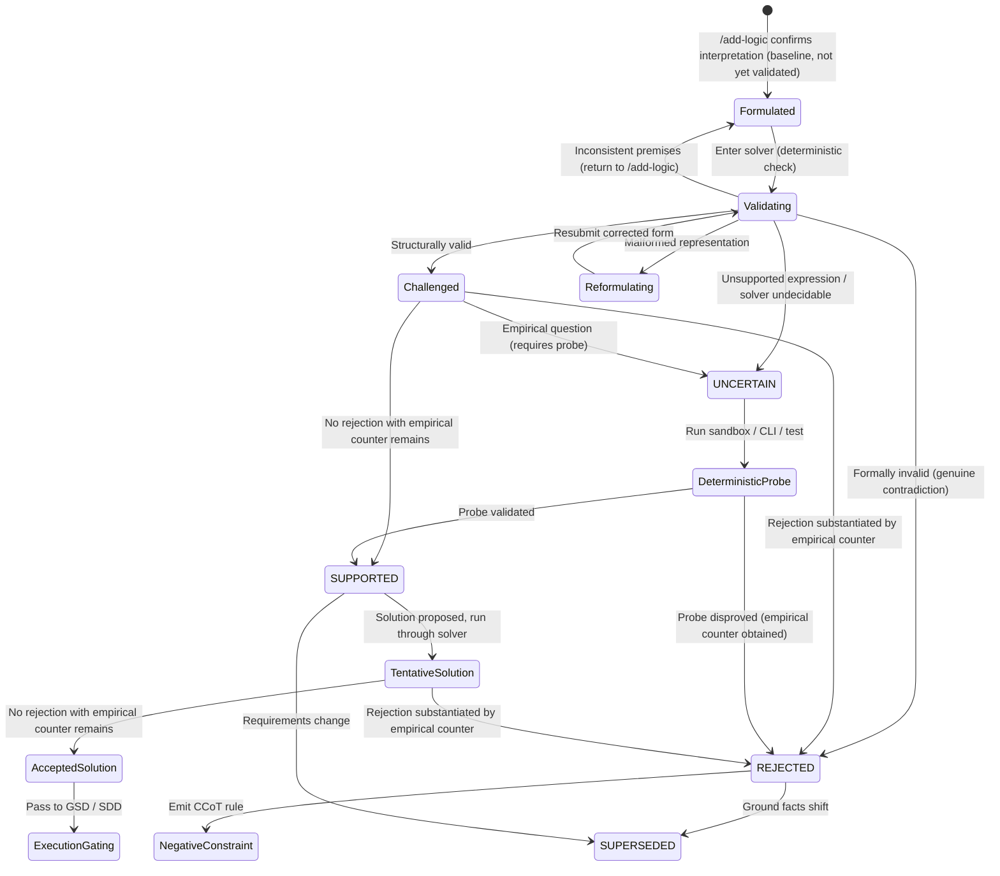

# Logical Ledger Specification (Epistemic Registry)

The **Logical Ledger** is the truth-maintenance core of Grill-Logic. It synthesizes classical **Assumption-based Truth Maintenance Systems (ATMS)** with modern **Contrastive Chain-of-Thought (CCoT)**, providing a dynamic registry of verified, refuted, and uncertain premises.

Its primary purpose is to act as a **negative constraint firewall**: once an argument or premise is refuted, the ledger stores an explicit contrastive rule that prevents the agent from hallucinating back into the invalid reasoning path in later turns (*anti-semantic-attraction*).

> **v1.1 revision (updated for ADR-0003).** This spec reflects the `/add-logic` → Deterministic Validation → Solution Proposal/Acceptance decomposition of *Challenge* and Pure Negative-Constraint Falsification (see `references/adr/0003-negative-constraint-falsification-and-anti-prescriptive-firewall.md`). Previous ambiguities were resolved, and ADR-0003 establishes pure negative-constraint falsification where the firewall evaluates proposals strictly against the normalized target space ($C_{\text{rejected}} \cup R_{\text{refute\_boundary}}$) under the Zero-Flag User Contract. Section 2, Section 4, and Section 6 govern these invariants.

---

## 1. Storage Modalities

Grill-Logic supports two ledger storage modalities:

1. **Persistent Project Ledger (`LOGICAL_LEDGER.md`)**:
   Stored at the root of the project repository. Serves as the source of truth across multiple sessions, multi-turn feature builds, and sub-agent handoffs.
2. **Ephemeral Inline Block**:
   Rendered directly in conversational context for lightweight, single-turn, or exploratory sessions.

---

## 2. Interpretation Gate: `/add-logic`

No argument enters the ledger directly. Every entry is created by the `/add-logic` skill, which is a **mandatory prerequisite** to both `/grill-logic` and `/self-grill`. Neither challenge mode may create an entry on its own; if `/add-logic` hasn't already run for a given prompt, the challenge skill invokes it first.

`/add-logic` is always a Human ↔ LLM exchange, in both modes — this holds even when the subsequent challenge is delegated to a subagent under `/self-grill` (see §4.3). It does three things, in order:

1. **Decomposes** the premises and conclusion from the source prompt into logical form.
2. **Presents** that interpretation to the user and waits for agreement. If the user corrects the logical set, the correction is accepted verbatim as the baseline — even if it is erroneous. Agreement here confirms *what is being discussed*, not that it is *true*.
3. **Adds** the confirmed logical set to the ledger as `FORMULATED` (§4) — unless the ledger already contains the same entry, or the new one is too close to an existing entry to be a meaningful duplicate, in which case the model informs the user rather than silently declining.

A `FORMULATED` entry carries no `SUPPORTED` / `REJECTED` / `UNCERTAIN` label. It is a confirmed baseline, not yet a validated one. It earns a label only after passing deterministic validation (§4) and, where applicable, a challenge exchange.

---

## 3. Ledger Schema

### Standard Markdown Table Format

```markdown
# Epistemic Decision Registry: Logical Ledger

| Arg ID | Premises (P) | Proposed Conclusion (C) | Status | Challenger & Evidence | Resulting Action / Contrastive Refutation Rule |
| :--- | :--- | :--- | :--- | :--- | :--- |
| **ARG-01** | **P1**: High database read latency.<br>**P2**: Redis has sub-ms read speeds.<br>**P_hidden**: Latency is read-throughput bound. | **C**: Add Redis caching layer in front of the database. | **REJECTED**<br>*(Invalid Leap)* | **Subagent DMAD Audit** ($W_{\text{subagent}} > W_{\text{LLM}}$, $S_{\text{LLM}}$=high): Latency caused by missing composite index on `users(tenant_id, created_at)` causing unindexed table scans. | **Contrastive Rule**: Do not infer caching layer ($C$) from read latency ($P1$) without verifying query execution plans.<br>**Derived Action**: Add composite index ($C'$). |
| **ARG-02** | **P1**: System processes EU patient health records.<br>**P2**: GDPR & HIPAA require cryptographic and physical tenancy isolation. | **C**: Separate PostgreSQL database instance per tenant. | **SUPPORTED** | **User Concordance** ($W_{\text{human}}$=high, $S_{\text{human}}$=dampened): User confirmed strict compliance mandate prohibits shared schema tenancy. | **Pass to Execution**: Clear task for multi-database tenancy module ($C$). |
| **ARG-03** | **P1**: Project needs high-throughput zero-copy serialization on Windows.<br>**P_hidden**: `io_uring` is supported on Windows NT kernel. | **C**: Implement kernel-level async I/O via `io_uring`. | **REJECTED**<br>*(False Axiom)* | **Deterministic Probe** ($W$=high, empirical): `io_uring` is a Linux-specific kernel interface; Windows uses IOCP. | **Contrastive Rule**: Do not attempt `io_uring` architectures on Windows runtimes.<br>**Derived Action**: Implement Windows I/O Completion Ports (IOCP) ($C'$). |
```

> **Note on the `Status` column.** A status is a *derived* value, not an assertion of truth. `SUPPORTED` means no rejection backed by an empirical counter currently stands against the entry — it does not mean the premises are proven true in an absolute sense. See §4.3 for the rule that derives it.

---

## 4. Epistemic Status Lifecycle

### 4.1 State Diagram



Two additions relative to v1.0:

* **`Validating`** sits between `Formulated` and `Challenged` and represents the deterministic-solver step. It is not a single pass/fail gate — see the failure taxonomy in §4.2.
* **`TentativeSolution` / `AcceptedSolution`** give the proposed conclusion its own lifecycle. A solution goes through the same solver check and the same Empirical-Counter Rule (§4.3) that a premise does; it does not inherit `SUPPORTED` from the premises it's built on.

### 4.2 Status Definitions

* **`FORMULATED`**:
  - The output of `/add-logic`. The user has confirmed this is the correct decomposition of the prompt — not that it is true.
  - Carries no epistemic label. Must pass `Validating` before it can be `Challenged`.

* **`SUPPORTED`**:
  - No rejection backed by an empirical counter currently stands against the inferential leap $(P_1 \land \dots \land P_n) \implies C$.
  - A statement about the current state of the challenge exchange, not a claim of absolute truth. A `SUPPORTED` entry can still move to `SUPERSEDED` if ground facts shift.
  - The conclusion is cleared for downstream task planning and code generation.

* **`REJECTED`**:
  - Reached one of two ways, and only these two:
    1. The solver finds the argument **formally invalid** — the conclusion doesn't follow, or the premises are self-contradictory (a `Validating` outcome); or
    2. A party's rejection is backed by an **empirical counter** — a probe result, cited evidence, or a demonstrated logical flaw (a `Challenged` outcome).
  - A rejection with no empirical counter behind it does **not** move an entry to `REJECTED`. It is recorded, but the entry stays `SUPPORTED` or `UNCERTAIN` until the rejection is substantiated.
  - The entry must record an explicit **Contrastive Refutation Rule** (§5).
  - Downstream execution of $C$ is strictly blocked.

* **`UNCERTAIN`**:
  - The truth value of a premise cannot be settled through pure reasoning or user dialogue, or the solver's `Validating` pass could not decide the expression (unsupported or undecidable).
  - The argument transitions out of `UNCERTAIN` only after a targeted spike or command probe completes.

* **`TENTATIVE_SOLUTION`** *(intermediate, not terminal)*:
  - A proposed conclusion — the original $C$ or a synthesized $C'$ — that has passed the solver check but has not yet cleared the Empirical-Counter Rule.

* **`ACCEPTED_SOLUTION`**:
  - A tentative solution against which no rejection backed by an empirical counter remains.
  - This is a **procedural** acceptance: the protocol has grounds to advance, not a claim that both parties have affirmatively declared belief. See §4.3.

* **`SUPERSEDED`**:
  - A previously audited argument whose foundational premises or external ground facts have materially changed (e.g., an upstream library releases native cross-platform support, or infrastructure constraints shift).
  - **Protocol**: Mark status as **`SUPERSEDED by ARG-XX`** linking to the new audit entry that validates the shifted premises.
  - **Constraint Release**: The prior negative constraint is deactivated, unblocking execution under the new premises while permanently preserving the historical audit trail.

### 4.3 The Two-Party & Empirical-Counter Rule

`/add-logic` (§2) is always Human ↔ LLM. The challenge exchange that follows has exactly two parties, never three, and which two depends on mode:
* **`/grill-logic`**: Human $\leftrightarrow$ LLM.
* **`/self-grill`**: LLM $\leftrightarrow$ Subagent (acting under delegated human authority).

In `/self-grill`, the subagent acts on the human's delegated authority for the challenge exchange — it is not a third party the human must also separately agree with.

The rule governing every status transition in §4.1 is: **a rejection is not accepted as valid unless it is backed by an empirical counter.** The absence of a counter from one party is not evidence of agreement — it may mean uncertainty, missing evidence, or that the point hasn't been evaluated. It only means the protocol currently has no substantiated objection blocking it, so it may proceed to `SUPPORTED` / `ACCEPTED_SOLUTION`.

To make this auditable instead of a single accepted/not-accepted flag, entries carry a running **tally** — `agree`, `disagree`, `uncertain` — tracked separately for the argument's premises and, once one exists, for its solution. See the `tally` field in §6.

---

## 5. Contrastive Refutation Rules (CCoT)

When an argument is marked `REJECTED`, Grill-Logic formulates a contrastive boundary rule adhering to this syntax:

```text
CONTRASTIVE RULE:
  Do not infer [Conclusion C] from [Premises P]
  BECAUSE [Counter-Evidence / Refutation E].
  MANDATED ALTERNATIVE: [Valid Conclusion C' or Diagnostic Step].
```

A contrastive rule is only emitted for a genuine `REJECTED` outcome: formal invalidity found by the solver, or a rejection backed by an empirical counter (§4.3). A solver failure that turns out to be malformed input, an unsupported expression, or an undecidable case does not produce a contrastive rule — it routes back to reformulation, to `/add-logic`, or to `UNCERTAIN` instead (§4.2).

### Why This Pre-empts Failure Modes
1. **Prevents Regression**: LLMs naturally drift toward familiar architectural tropes (e.g., reaching for Redis, Kafka, or microservices). Storing contrastive refutations directly in context blocks the semantic gravity of default patterns.
2. **Deterministic Pre-flight Checks**: Procedural engines (such as GSD or Spec-Driven Development) inspect the ledger prior to creating tasks. Any task relying on an argument flagged `REJECTED` is automatically rejected at the boundary.

---

## 6. Machine-Readable Schema (Optional / Tool Integration)

For automated pipelines or sub-agents that consume the ledger programmatically:

```json
{
  "$schema": "https://json-schema.org/draft/2020-12/schema",
  "title": "LogicalLedger",
  "type": "object",
  "required": ["ledger_version", "entries"],
  "properties": {
    "ledger_version": { "type": "string", "enum": ["1.0.0", "1.1.0"] },
    "project_name": { "type": "string" },
    "entries": {
      "type": "array",
      "items": {
        "type": "object",
        "required": ["arg_id", "source_prompt", "premises", "conclusion", "status", "mode", "challenger"],
        "properties": {
          "arg_id": { "type": "string" },
          "source_prompt": { "type": "string" },
          "mode": {
            "type": "string",
            "enum": ["grill-logic", "self-grill"],
            "description": "Which two-party challenge exchange this entry belongs to: human/LLM, or LLM/subagent. /add-logic itself is always human/LLM regardless of this value."
          },
          "premises": {
            "type": "array",
            "items": {
              "type": "object",
              "required": ["id", "statement", "type"],
              "properties": {
                "id": { "type": "string" },
                "statement": { "type": "string" },
                "type": { "type": "string", "enum": ["explicit", "hidden"] }
              }
            }
          },
          "conclusion": { "type": "string" },
          "status": {
            "type": "string",
            "enum": ["FORMULATED", "SUPPORTED", "REJECTED", "UNCERTAIN", "TENTATIVE_SOLUTION", "ACCEPTED_SOLUTION", "SUPERSEDED"]
          },
          "validation": {
            "type": "object",
            "description": "Result of the deterministic-solver check (§4.1). Only 'formally_invalid' justifies REJECTED on its own; every other result routes elsewhere per §4.2.",
            "properties": {
              "result": {
                "type": "string",
                "enum": ["valid", "formally_invalid", "malformed", "unsupported_expression", "inconsistent_premises", "undecidable"]
              },
              "notes": { "type": "string" }
            }
          },
          "tally": {
            "type": "object",
            "description": "Running agreement record backing the derived status (§4.3), tracked separately for the argument's premises and its solution.",
            "properties": {
              "premises": {
                "type": "object",
                "properties": {
                  "agree": { "type": "integer" },
                  "disagree": { "type": "integer" },
                  "uncertain": { "type": "integer" }
                }
              },
              "solution": {
                "type": "object",
                "properties": {
                  "agree": { "type": "integer" },
                  "disagree": { "type": "integer" },
                  "uncertain": { "type": "integer" }
                }
              }
            }
          },
          "challenger": {
            "type": "object",
            "required": ["party", "actor", "evidence"],
            "properties": {
              "party": {
                "type": "string",
                "enum": ["human", "llm", "subagent"],
                "description": "Which of the two parties named in `mode` raised this challenge."
              },
              "actor": { "type": "string", "enum": ["deterministic_probe", "internal_cot", "human_mcq"] },
              "evidence": { "type": "string" },
              "empirical_counter": {
                "type": "boolean",
                "description": "True only if `evidence` constitutes an empirical counter per §4.3. `status: REJECTED` requires this to be true, or `validation.result` to be 'formally_invalid'."
              }
            }
          },
          "contrastive_rule": { "type": "string" },
          "derived_action": { "type": "string" }
        }
      }
    }
  }
}
```

**Compatibility:** `ledger_version: "1.0.0"` remains valid for existing ledgers. The new fields — `mode`, `validation`, `tally`, `challenger.party`, `challenger.empirical_counter` — are optional on `1.0.0` entries and required going forward under `1.1.0`.
