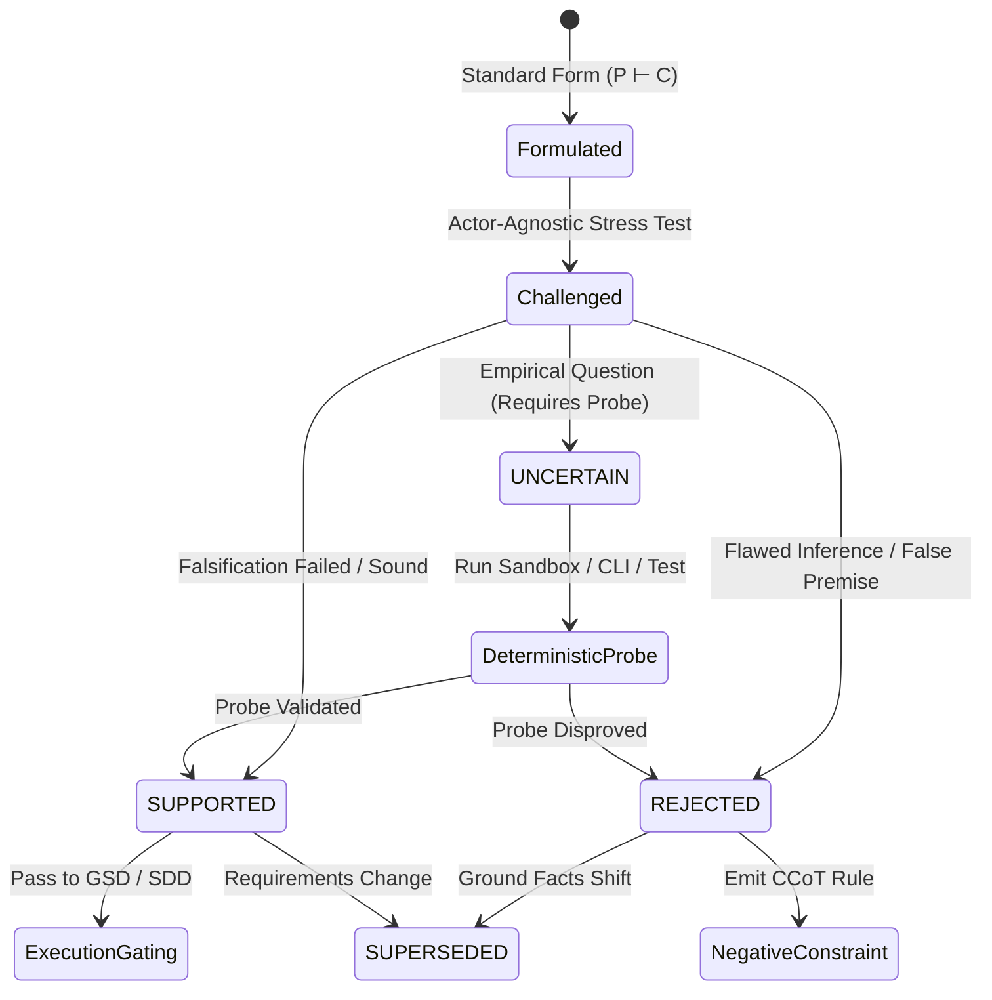

# Logical Ledger Specification (Epistemic Registry)

The **Logical Ledger** is the truth-maintenance core of Grill-Logic. It synthesizes classical **Assumption-based Truth Maintenance Systems (ATMS)** with modern **Contrastive Chain-of-Thought (CCoT)**, providing a dynamic registry of verified, refuted, and uncertain premises.

Its primary purpose is to act as a **negative constraint firewall**: once an argument or premise is refuted, the ledger stores an explicit contrastive rule that prevents the agent from hallucinating back into the invalid reasoning path in later turns (*anti-semantic-attraction*).

---

## 1. Storage Modalities

Grill-Logic supports two ledger storage modalities:

1. **Persistent Project Ledger (`LOGICAL_LEDGER.md`)**:
   Stored at the root of the project repository. Serves as the source of truth across multiple sessions, multi-turn feature builds, and sub-agent handoffs.
2. **Ephemeral Inline Block**:
   Rendered directly in conversational context for lightweight, single-turn, or exploratory sessions.

---

## 2. Ledger Schema

### Standard Markdown Table Format

```markdown
# Epistemic Decision Registry: Logical Ledger

| Arg ID | Premises ($P$) | Proposed Conclusion ($C$) | Status | Challenger & Evidence | Resulting Action / Contrastive Rule |
| :--- | :--- | :--- | :--- | :--- | :--- |
| **ARG-01** | **P1**: High database read latency.<br>**P2**: Redis has sub-ms read speeds.<br>**P_hidden**: Latency is read-throughput bound. | **C**: Add Redis caching layer in front of the database. | **REJECTED**<br>*(Invalid Leap)* | **Subagent DMAD Audit** ($W_{\text{subagent}} > W_{\text{LLM}}$, $S_{\text{LLM}}$=high): Latency caused by missing composite index on `users(tenant_id, created_at)` causing unindexed table scans. | **Contrastive Rule**: Do not infer caching layer ($C$) from read latency ($P1$) without verifying query execution plans.<br>**Derived Action**: Add composite index ($C'$). |
| **ARG-02** | **P1**: System processes EU patient health records.<br>**P2**: GDPR & HIPAA require cryptographic and physical tenancy isolation. | **C**: Separate PostgreSQL database instance per tenant. | **SUPPORTED** | **User Concordance** ($W_{\text{human}}$=high, $S_{\text{human}}$=dampened): User confirmed strict compliance mandate prohibits shared schema tenancy. | **Pass to Execution**: Clear task for multi-database tenancy module ($C$). |
| **ARG-03** | **P1**: Project needs high-throughput zero-copy serialization on Windows.<br>**P_hidden**: `io_uring` is supported on Windows NT kernel. | **C**: Implement kernel-level async I/O via `io_uring`. | **REJECTED**<br>*(False Axiom)* | **Deterministic Probe** ($W$=high, empirical): `io_uring` is a Linux-specific kernel interface; Windows uses IOCP. | **Contrastive Rule**: Do not attempt `io_uring` architectures on Windows runtimes.<br>**Derived Action**: Implement Windows I/O Completion Ports (IOCP) ($C'$). |
```

---

## 3. Epistemic Status Lifecycle



### Status Definitions

* **`SUPPORTED`**:
  - The inferential leap $(P_1 \land \dots \land P_n) \implies C$ is logically sound.
  - All explicit and hidden premises have been verified or accepted by domain stakeholders.
  - The conclusion is cleared for downstream task planning and code generation.
* **`REJECTED`**:
  - The conclusion does not follow from the premises (non sequitur, false dilemma, unaddressed root cause), or a foundational premise is factually false.
  - The entry must record an explicit **Contrastive Refutation Rule**.
  - Downstream execution of $C$ is strictly blocked.
* **`UNCERTAIN`**:
  - The truth value of a premise cannot be settled through pure reasoning or user dialogue; it requires empirical verification in the runtime environment (e.g., library ABI compatibility, sandbox execution).
  - The argument transitions out of `UNCERTAIN` only after a targeted spike or command probe completes.
* **`SUPERSEDED`**:
  - A previously audited argument whose foundational premises or external ground facts have materially changed (e.g., an upstream library releases native cross-platform support, or infrastructure constraints shift).
  - **Protocol**: Mark status as **`SUPERSEDED by ARG-XX`** linking to the new audit entry that validates the shifted premises.
  - **Constraint Release**: The prior negative constraint is deactivated, unblocking execution under the new premises while permanently preserving the historical audit trail.

---

## 4. Contrastive Refutation Rules (CCoT)

When an argument is marked `REJECTED`, Grill-Logic formulates a contrastive boundary rule adhering to this syntax:

```text
CONTRASTIVE RULE:
  Do not infer [Conclusion C] from [Premises P]
  BECAUSE [Counter-Evidence / Refutation E].
  MANDATED ALTERNATIVE: [Valid Conclusion C' or Diagnostic Step].
```

### Why This Pre-empts Failure Modes
1. **Prevents Regression**: LLMs naturally drift toward familiar architectural tropes (e.g., reaching for Redis, Kafka, or microservices). Storing contrastive refutations directly in context blocks the semantic gravity of default patterns.
2. **Deterministic Pre-flight Checks**: Procedural engines (such as GSD or Spec-Driven Development) inspect the ledger prior to creating tasks. Any task relying on an argument flagged `REJECTED` is automatically rejected at the boundary.

---

## 5. Machine-Readable Schema (Optional / Tool Integration)

For automated pipelines or sub-agents that consume the ledger programmatically:

```json
{
  "$schema": "https://json-schema.org/draft/2020-12/schema",
  "title": "LogicalLedger",
  "type": "object",
  "required": ["ledger_version", "entries"],
  "properties": {
    "ledger_version": { "type": "string", "enum": ["1.0.0"] },
    "project_name": { "type": "string" },
    "entries": {
      "type": "array",
      "items": {
        "type": "object",
        "required": ["arg_id", "source_prompt", "premises", "conclusion", "status", "challenger"],
        "properties": {
          "arg_id": { "type": "string" },
          "source_prompt": { "type": "string" },
          "premises": {
            "type": "array",
            "items": {
              "type": "object",
              "required": ["id", "statement", "type"],
              "properties": {
                "id": { "type": "string" },
                "statement": { "type": "string" },
                "type": { "type": "string", "enum": ["explicit", "hidden"] }
              }
            }
          },
          "conclusion": { "type": "string" },
          "status": { "type": "string", "enum": ["SUPPORTED", "REJECTED", "UNCERTAIN"] },
          "challenger": {
            "type": "object",
            "required": ["actor", "evidence"],
            "properties": {
              "actor": { "type": "string", "enum": ["deterministic_probe", "internal_cot", "human_mcq"] },
              "evidence": { "type": "string" }
            }
          },
          "contrastive_rule": { "type": "string" },
          "derived_action": { "type": "string" }
        }
      }
    }
  }
}
```
